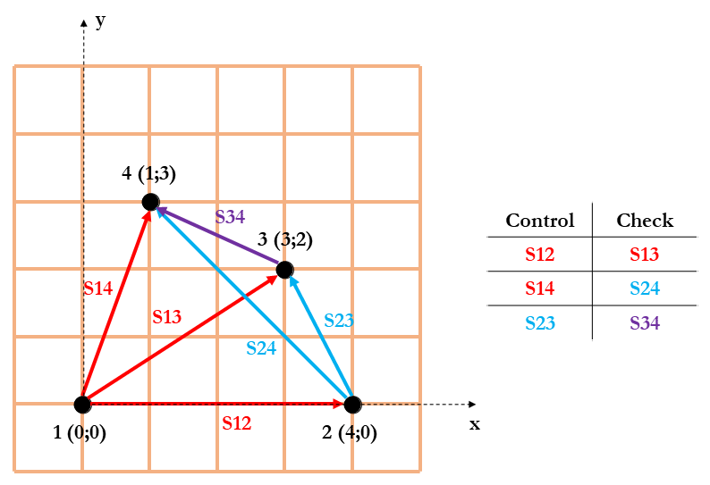

# Metashape-Utils

 

This repository allows the user to automatically scale a 3D model/mesh/point cloud on [Agisoft Metashape](https://www.agisoft.com/), given a set of 2D coordinates (in a local 
coordinate reference system - **CRS**) of **N** markers collimated onto one (or **M**) plane(s). 

The number of markers **N** and planes **M** is arbitrary. 

The coordinates must be stored into a `.yaml` file like the example `pars.yaml`. 

Starting from the provided set of markers, the script `scalebars.py` generates all the possible scale bars per plane, and subdivides them into two equally numerous subsets of control and check bars, as shown in the example below.
  

Because of this, in the same `.yaml` parameter file, the user must also provide the accuracy of the scale bars, and the chunk id of the 3D model/mesh/point cloud to scale. 

After the 3D model/mesh/point is scaled, the RMSE of the control and check bars is saved into a `Statistics_scalebars.txt` file. 

To run the script `scalebars.py`, the user must launch Metashape, press `CTRL + R`, and write the path of the script `scalebars.py` as **Script** and the path of the `.yaml` 
file as **Argument**.

The script `test.py`, instead, allows the user to assess the relationship between RMSE and number of scale bars; to investigate this relationship from a statistically relevant
point of view, the test is repeated **I** times, where **I** is the number of iterations (which is a parameter to set in the `.yaml` file). 

The values of RMSE are then saved to a `.csv` file, whose path must be defined in the `.yaml` file. 

Finally, a plot of the relationship is produced.

To launch the script `test.py`, the same instructions as `scalebars.py` can be followed.

